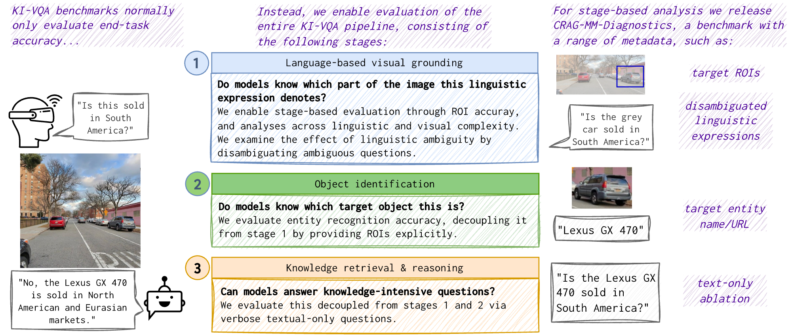

# *CRAG-MM-Diagnostics: Enabling Stage-wise Analysis Of Knowledge-Intensive VQA* 


[](https://arxiv.org/abs/2607.21155)
[](https://huggingface.co/collections/McGill-NLP/crag-mm-diagnostics)
[](https://github.com/McGill-NLP/crag-mm-diagnostics/blob/main/LICENSE)


## Illustration of the stage-wise evaluation enabled by CRAG-MMDiagnostics




## Setup

```bash
$ conda create -n cragmm_diagnostics python=3.10
$ conda activate cragmm_diagnostics
$ pip install -r requirements.txt
```

## Evaluation

### Decoupled Stage Evaluation

```bash
bash ./batch_eval.sh
```

#### 1. Language-based Visual Grounding
- `visual_grounding` : Given image and original query, the task is to find target region's coordinates as output.
 
#### 2. Object Identification

We separate input variants to enable understanding of each modality for object identification task.

##### Task Types
- `object_identification`: Target region highlighting with bounding box and original query.
- `object_identification_easy_query`: Target region highlighting with bounding box; uses identification prompt "what is the name of the object" as query.
- `object_identification_with_original`: Original image and query are used together.
- `object_identification_image_only`: Uses only original image with identification prompt "what is the name of the object" as query.

#### 3. Knowledge-intensive Question Answering

##### Task Types

- `knowledge_extraction`: Uses textual-only questions. (e.g., Image + When is the production year of this car? -> **When is the production year of Toyota Prius?**)
- `whole`: Uses original image and text together to solve QA tasks.


### With Retrieval Augmentation (RAG)

**Prerequisites:**
- Generate indexing files for each retriever 

```bash
bash ./eval_rag.sh
```

## Bugs or questions?
- If you have any questions about the code, feel free to open an issue on the GitHub repository.
- mail at : hanseok [dot] oh [at] nyu.edu

## Citing
If you find this code / dataset useful, please consider citing our work:

```bibtex
@article{oh2026crag,
  title={CRAG-MM-Diagnostics: Enabling Stage-Wise Analysis of Knowledge-Intensive VQA},
  author={Oh, Hanseok and BehnamGhader, Parishad and Krojer, Benno and Lee, Hyunji and Liang, Paul and Reddy, Siva and Dankers, Verna},
  journal={arXiv preprint arXiv:2607.21155},
  year={2026}
}
```